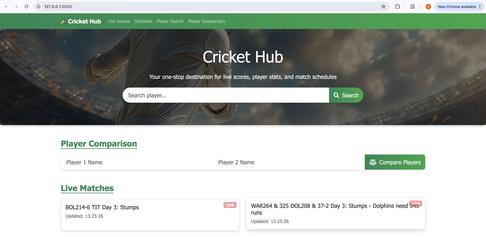
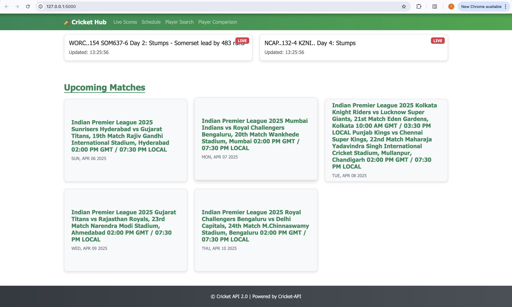
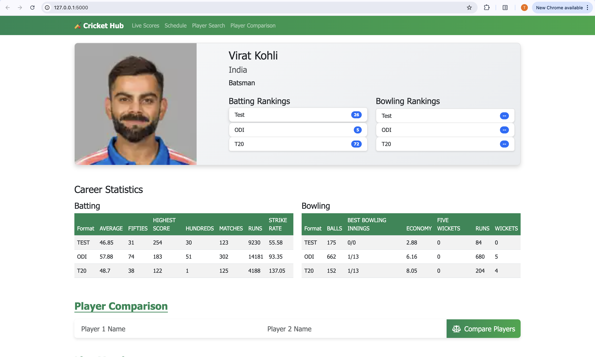
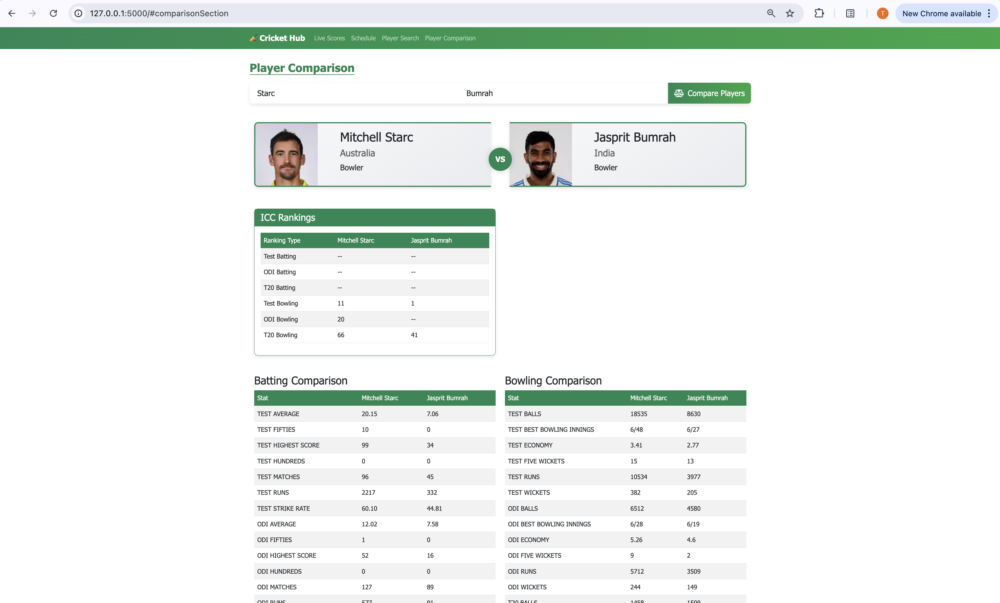

<H2>Cricket Hub - Cricket API 2.0</H2>
This is a simple Flask web application that provides an API and a user-friendly website to retrieve Player Stats, Live Scores, Fixtures, Tables, and Results data of Cricket Matches (ODI, T20, Test, and IPL) from the online websites

<h2>Website Features</h2>

The application now includes a website accessible with the following features:

<ul>
  <li>🎯 <strong>Live Scores:</strong> View live scores of ongoing matches with real-time updates.</li>
  <li>📅 <strong>Schedule:</strong> Check the schedule of upcoming matches, including dates and teams.</li>
  <li>👤 <strong>Player Stats:</strong> Search for player statistics, including batting and bowling career summaries.</li>
  <li>⚖️ <strong>Compare Players:</strong> Compare two players' stats side by side for better insights.</li>
</ul>

<h2>API Endpoints</h2>

The application provides the following API endpoints:

<h3>GET  /players/{player_name}</h3>

This endpoint retrieves information about a cricket player with the given name. The player name should be provided as a URL parameter.

The API returns a JSON object with the following structure:

<pre><code>[
    {
        "Player Name": "Player Name",
        "Country": "Country",
        "Role": "Role",
        "Batting Career Summary 1": {
            "Mode1": "Test",
            "Matches": "Matches",
            "Runs": "Runs",
            "HS": "HS",
            "Avg": "Avg",
            "SR": "SR",
            "100s": "100s",
            "50s": "50s"
        },
        "Batting Career Summary2": {
            "Mode2": "ODI",
            "Matches": "Matches",
            "Runs": "Runs",
            "HS": "HS",
            "Avg": "Avg",
            "SR": "SR",
            "100s": "100s",
            "50s": "50s"
        },
        "Batting Career Summary3": {
            "Mode2": "T20I",
            "Matches": "Matches",
            "Runs": "Runs",
            "HS": "HS",
            "Avg": "Avg",
            "SR": "SR",
            "100s": "100s",
            "50s": "50s"
        }
    }
]</code></pre>

<h3>GET /schedule</h3>

The API returns a JSON array containing the details of upcoming matches, including date, teams, and tournament.

The API returns a JSON object with the following structure:

<pre><code>
[
    "India vs South Africa, 1st ODI",
    "India vs South Africa, 2nd ODI",
    // ... additional matches
]
</code></pre>

<h3>GET /live</h3>

The API returns a JSON array containing the details of live matches, including team names, scores, and overs played.

The API returns a JSON object with the following structure:

<pre><code>
[
    "RCB196-7 (20 Ovs) CSK9-2 (2.3 Ovs) Chennai Super Kings need 188 runs",
    // ... additional live matches
]
</code></pre>

<h2>Live Score</h2>
<ul>
  <li>Live Score of all the Matches Going on present</li>
      
</ul>

<h2>Schedule</h2>
<ul>
  <li>Schedule of the next Upcoming Matches</li>
      
</ul>

<h2>Individual Player Stats</h2>
<ul>
  <li>Example: Stats of Virat Kohli | You can use the common name of the Players as well to retrieve the details</li>
      
</ul>

<h2>Player Comparison</h2>
<ul>
  <li>Compare two players' batting and bowling statistics side by side.</li>
      
</ul>

<h2>Update 🚀</h2>

The API and website have been enhanced with new features and improvements:

<ul>
  <li>🎯 Added a user-friendly UI website for interacting with live scores, player stats, schedule, and player comparison.</li>
  <li>⚡ Optimized the codebase for better performance and reliability.</li>
  <li>🔄 Rebased and updated to ensure compatibility with the latest dependencies.</li>
</ul>

Enjoy the latest version of the Cricket API and website! 🏏

<H2>Disclaimer ⚠️</H2>
This project is strictly for educational purposes. Not intended for production use. The frontend HTML was generated using GPT